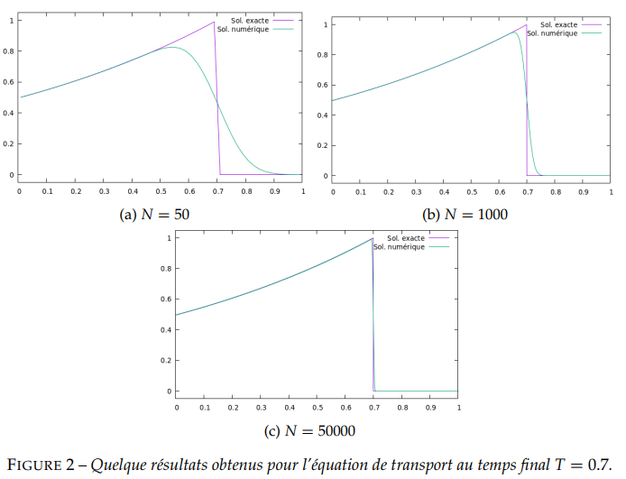
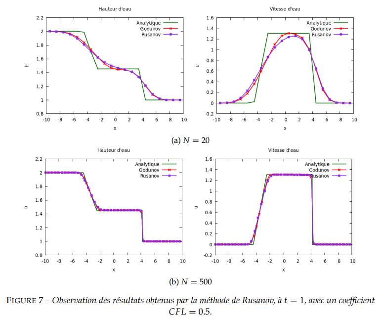
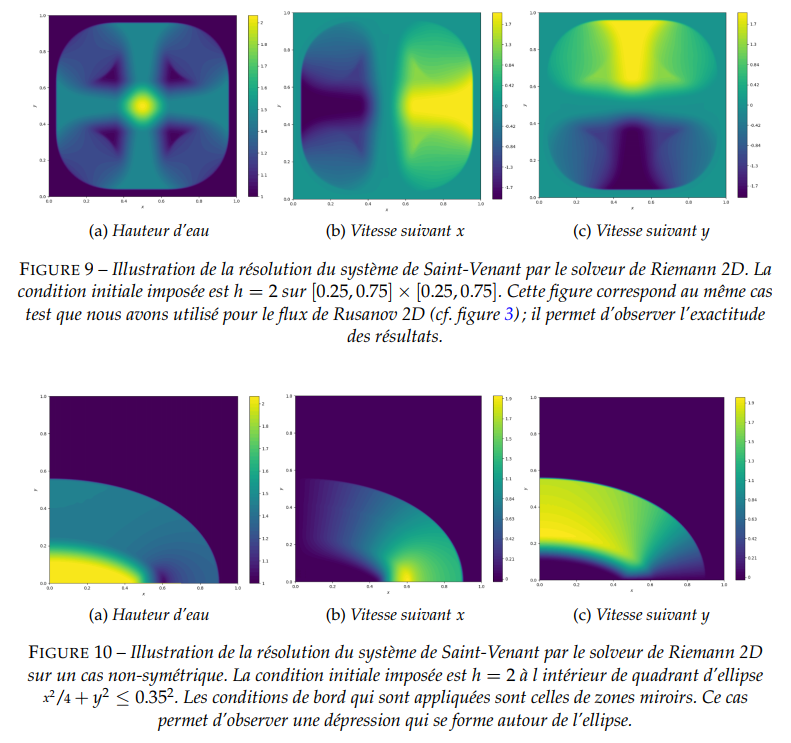

# Hyperbolic Solvers
A bunch of solvers (Godunov, Rusanov, VFRoe, MUSCL, etc.) for some of the most common hyperbolic problems, using the Finite Volume Method.

## Screenshots

- ### Problem 1 : Transport and Burgers equations

- ### Problem 2 : Shallow-water equation in 1D

- ### Problem 3 : Shallow-water equation in 2D

